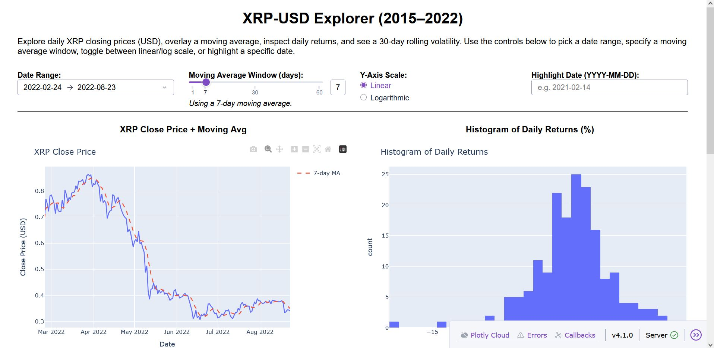
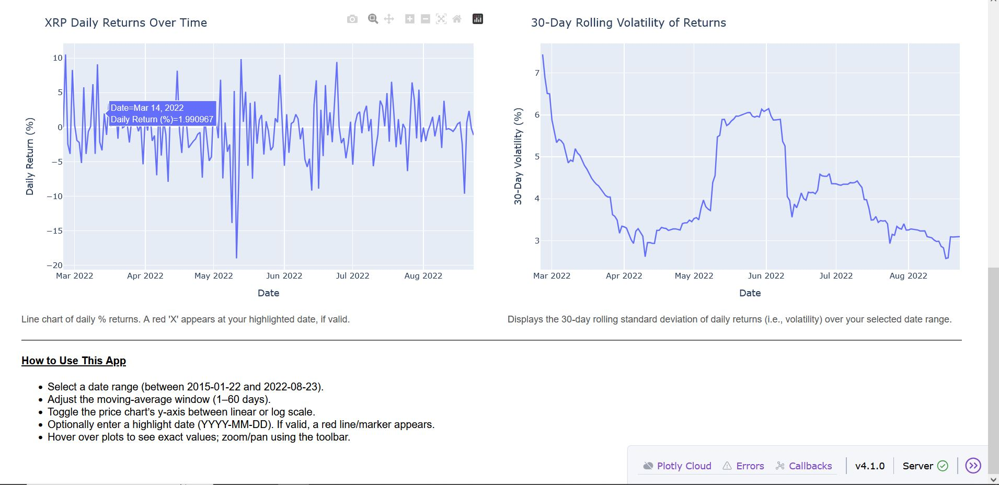

# XRP‐USD Explorer (Dash Application)

**Author:** Jordon Abrams 

**Date:** June 4, 2025  

---

## 1. Project Overview

The **XRP‐USD Explorer** is a Dash application that allows users to interactively explore daily XRP (Ripple) closing prices (USD) from January 2015 through December 2022. Key features include:

- **Date Range Selection:** Pick any subset of trading days between 2015-01-22 and 2022-08-23.  
- **Moving Average Overlay:** Specify a simple moving average window (1–60 days) to smooth the closing‐price time series.  
- **Y-Axis Scale Toggle:** Switch the price chart’s Y-axis between linear or logarithmic scales.  
- **Highlight a Specific Date:** Type any valid date (YYYY-MM-DD) in the chosen range to see a vertical red line on the price chart and a red “✕” marker on the returns chart.  
- **Histogram of Daily Returns:** Visualize the distribution of daily percentage returns for the selected date window.  
- **Daily Returns Time Series:** See day‐by‐day percentage changes over time, with optional highlighting.  
- **30-Day Rolling Volatility Chart:** Examine the rolling 30-day standard deviation of daily returns (an indicator of short‐term volatility).

This application is designed to be explanatory—helping users understand price trends, return patterns, and volatility over time.

---

## Dashboard Preview

### Dashboard Overview


### Returns & Volatility Analysis


---

## 2. Folder Structure

xrp-dash-app/  
├── app.py  
├── xrp.csv                  
├── requirements.txt         
└── README.md              


- `app.py`  
  - The main Dash application. Running `python app.py` launches the app on localhost:8050.
- `xrp.csv`  
  - Contains daily OHLC, volume, and other fields for XRP-USD sourced from Yahoo Finance.  
  - Must be present in this folder for the app to run.
- `requirements.txt`  
  - Lists exact package names (and version constraints) needed to run the app.
- `README.md`  
  - Provides project overview and detailed setup and usage instructions.

---

## 3. Data Source & Licensing

- **Source:**  
  - The `xrp.csv` file is taken from Kaggle’s “Top-10 Cryptocurrencies Historical Dataset”:  
    [https://www.kaggle.com/datasets/kaushiksuresh147/top-10-cryptocurrencies-historical-dataset](https://www.kaggle.com/datasets/kaushiksuresh147/top-10-cryptocurrencies-historical-dataset)  
  - Extract only the XRP portion (rows where `Name` or `Symbol` equals “XRP”) and save it as `xrp.csv`.  
  - This covers **2015-01-01** through **2022-12-31** for XRP.
  - This covers **2015-01-01 00:00 UTC** through **2022-12-31 00:00 UTC**.
    
- **Contents of `xrp.csv`:**  
  - Columns: `Date, Open, High, Low, Close, Adj Close, Volume` (Currency = “USD”).  
  - We use `Date`, `Close`, and `Volume` to compute daily returns (`Return`) and rolling volatility (`Vol30`).
- **Licensing:**  
  - Kaggle datasets often carry their own terms; this particular dataset is free to use for non‐commercial purposes.  
  - If you redistribute or deploy, please credit Kaggle and the original dataset author (“kaushiksuresh147”) as the data source.

---

## 4. Installation & Setup

Follow these steps to run the XRP Explorer locally. These instructions assume you are using a Windows, macOS, or Linux system with Python 3.7+ installed.

### 4.1. Clone the Repository

- Option A (with Git installed)

  - Choose a file path where you want the XRP-dash-app files to be located
  
  - Open a terminal or command prompt, then "cd" to the file path and run:

  ```
  git clone https://github.com/abramsj7/xrp-dash-app.git
  ```

   - Once you have downloaded xrp-dash-app to  that file path, "cd" to the xrp-dash-app folder:
   ```
   cd xrp-dash-app
   ```
  
- Option B (without Git)

  - Go to https://github.com/abramsj7/XRP-Dash-App

  - Click Code → Download ZIP

  - Unzip the downloaded file locally

  - cd into that folder

- Option C (Install Git)

  - If you don’t already have Git installed, follow the instructions below. Once Git is installed, return to Option A above.

    - Windows:

    - Go to https://git-scm.com/download/win

    - Run the downloaded installer and accept the defaults (make sure “Git from the command line” is selected under PATH).

    - Open a new Command Prompt or PowerShell and verify with:
    ```
    git --version
    ```

    - Mac OS (Open terminal and type):
    ```
    git --version
    ```

    - Linux (Debian/Ubuntu)
    ```
    sudo apt update
    sudo apt install git
    git --version
    ```
    
    - Linux (Fedora)
    ```
    sudo dnf install git
    git --version
    ```
    
### 4.2. Create & Activate a Virtual Environment
It is strongly recommended to use a virtual environment to avoid conflicts with other Python packages on your system.

Windows
```bash
py -m venv venv

venv\Scripts\activate
```

Mac OS / Linux
```bash
python3 -m venv venv

source venv/bin/activate
```

Once activated, your prompt should show (venv) at the beginning.

### 4.3. Install Dependencies

With the virtual environment activated, install required packages:

```bash
pip install -r requirements.txt
```

This will install:
dash>=2.0.0
pandas>=1.3.0
plotly>=5.0.0

## 4.4. Verify Data File
Ensure that xrp.csv exists in your project folder. If you cloned from GitHub and the CSV is included, you’re all set. If not, download the CSV from the Kaggle link described earlier and set it as xrp.csv.

## 5. Running the App
Within the same terminal (and virtual environment), run:

```bash
python app.py
```

You should see output similar to:

Dash is running on http://127.0.0.1:8050/

 * Serving Flask app “app”
 * Environment: production
 * Debug mode: on

Open your web browser and navigate to:

http://127.0.0.1:8050/

## 6. How to Use the App

- **Select a Date Range (top‐left):**

  - Click the calendar icons or type directly to choose any start and end dates between 2015-01-22 and 2022-08-23.

  - If you pick a start date after the end date, a warning appears; correct the order before proceeding.

- **Adjust the Moving Average Window (top‐center):**

  - Use the slider to set the window length (1–60 days).

  - The dashed red line on the “Price + MA” chart updates to reflect your chosen window.

  - The text below the slider shows “Using a X-day moving average.”

- **Toggle Y-Axis Scale (top‐right of slider):**

  - Pick “Linear” or “Logarithmic.”

  - This only affects the Y-axis of the “Price + MA” chart (allows you to spot percentage moves on long periods).

- **Highlight a Specific Date (far top‐right):**

  - Type any date in the format YYYY-MM-DD.

  - If it is (a) formatted correctly, (b) within your selected date range, and (c) exists in xrp.csv, a red vertical line will appear on the “Price + MA” chart and a red “✕” marker will appear on the “Returns Over Time” chart.

  - If invalid, the text below will show an error (e.g., “Date not found in dataset”).

### 6.1 Interpreting the Four Plots

- **XRP Close Price + Moving Avg**

  - Blue Line = daily closing price (USD) for XRP.

  - Red Dashed Line = simple moving average of the past X days (where X = slider value).

  - Highlight Vertical Line (if a date is entered) = visually marks that specific trading day.

- **Histogram of Daily Returns (%)**

  - Bins the daily percentage changes (Return = (Closeⁿ − Closeⁿ⁻¹)/Closeⁿ⁻¹ × 100) within the selected date range.

  - Shows frequency of small vs. large positive or negative returns.

- **XRP Daily Returns Over Time**

  - Plots daily % returns as a time series.

  - If you highlight a date, a red “✕” marks that day’s return (with a hover tooltip).

- **30-Day Rolling Volatility (%)**

  - Plots the rolling standard deviation of daily returns over a 30-day window.

  - This is a measure of short‐term volatility—high values indicate more fluctuation, lower values indicate calmer price action.

- **Hovering over any point in these charts will display exact values. Use the Plotly toolbar in each chart’s upper right corner to pan, zoom, reset axes, or download a PNG snapshot.**

## 7. Troubleshooting

1. “ModuleNotFoundError: No module named 'dash'”

Ensure you have activated your virtual environment:

```bash
source venv/bin/activate       # macOS/Linux
```

```bash
venv\Scripts\activate          # Windows
```

Then run:

```bash
pip install -r requirements.txt
```

2. Date Picker Limits

- If you try selecting a date before 2015-01-22 or after 2022-08-23, the date picker won’t allow it. Those are the earliest and latest dates in xrp.csv.

- Highlight Date Doesn’t Show:

    - Make sure you type in exactly YYYY-MM-DD. If it isn’t in the dataset (e.g. a weekend or holiday when XRP didn’t trade), you’ll see “Date not found in dataset.”

- App Doesn’t Load (Port in Use). If port 8050 is already occupied, you can run on a different port:

```bash
python app.py --port 8051
```

- If using a newer version of Dash that uses app.run(...), you can specify:

```bash
app.run(debug=True, port=8051)
```
